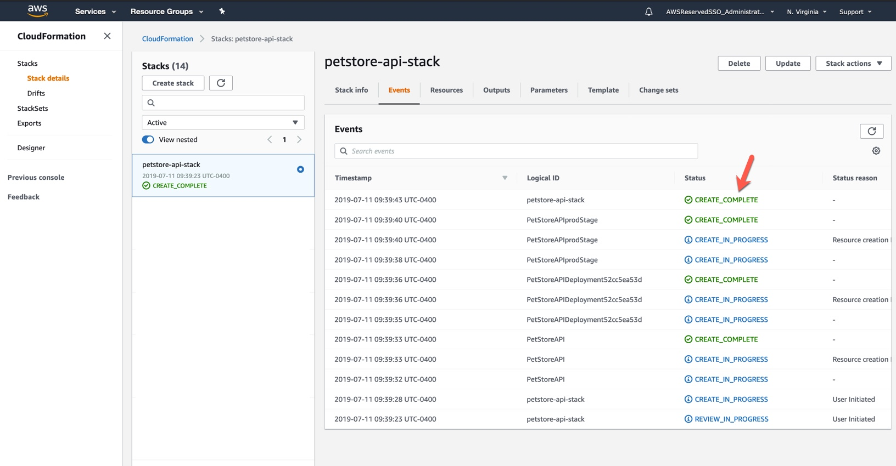
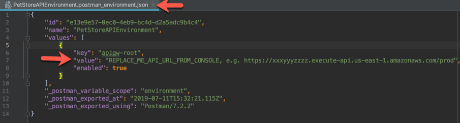
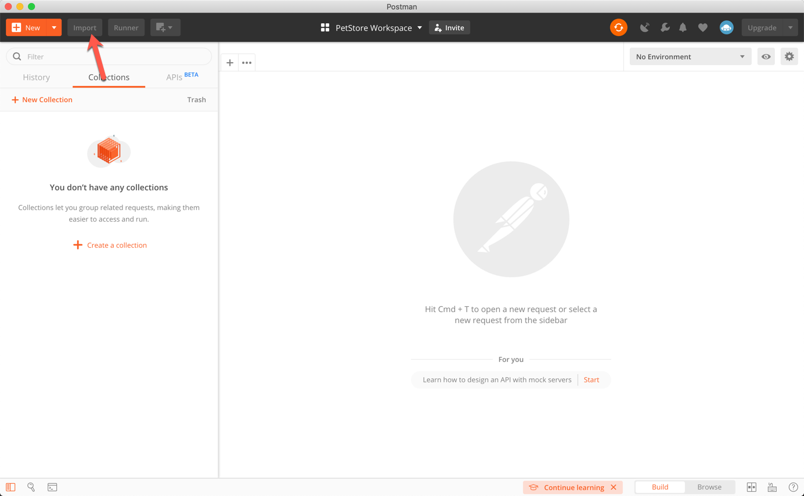
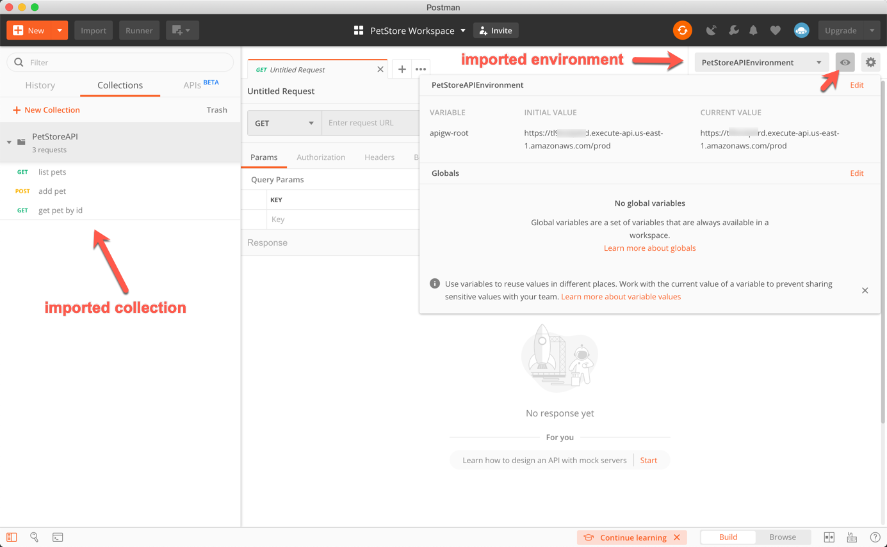
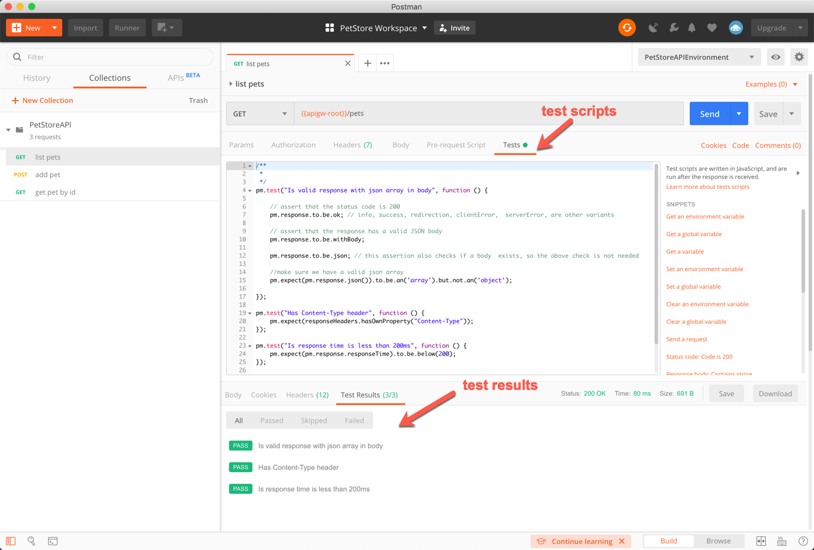
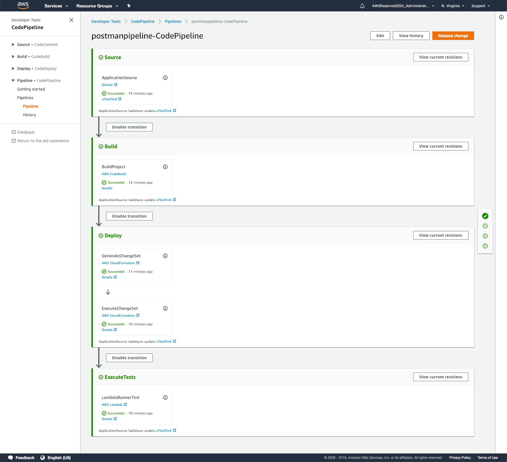
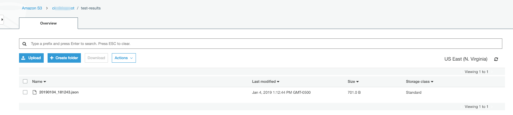
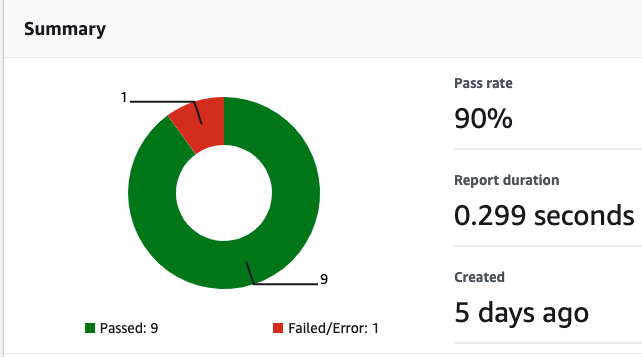
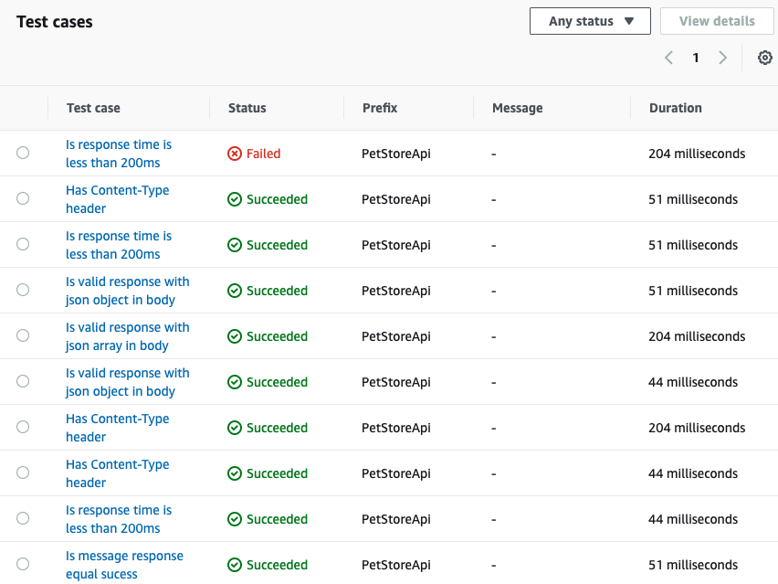
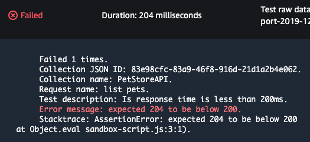

## Automating API Testing with AWS Code Pipeline, AWS Code Build, and Postman

This post demonstrates the use of AWS CodeBuild, CodePipeline and Postman to deploy, 
functionally test an API, and view the generated reports using a new feature from 
CodeBuild called Reports. 

A stage within AWS CodePipeline executes a functional test suite created with Postman.
Results are made available 

## 01 - API deployment

We will keep things simple and deploy a sample API that integrates via HTTP to demo Pet Store endpoints located here
http://petstore-demo-endpoint.execute-api.com/petstore/pets.

TODO: screen shot

### Instructions: 

* Fork the GitHub repo into your GitHub account
* Clone the forked repo to your local dev environment. You will need to do 
this in order to edit a configuration file and commit it to your repository later.
  * `git clone https://github.com/<YOUR_GITHUB_USERNAME>/AWSCodePipelineAndPostman`

* Create an S3 bucket to contain resources related to this project. Will will refer to this bucket as the 
project's root bucket.
  * using the AWS cli: `aws s3 mb s3://<REPLACE_ME_BUCKET_NAME>`

* Using your command line navigate to the directory (**01api**) containing the AWS SAM template used to package 
and deploy the PetStore API. 

* From there you execute the following commands to deploy the API. 
  - Executing this command will create the necessary resources (API Gateway) representing your 
  PetStore API.
  * NOTE: remember to specify your region and S3 bucket.

  ```console
  aws cloudformation package \
  --region us-east-1 \
  --template-file petstore-api.yaml \
  --s3-bucket <REPLACE_ME_BUCKET_NAME> \
  --s3-prefix api-code \
  --output-template-file petstore-api-output.yaml
  ```

  Execute the following to deploy your api

  **NOTE: above cli will return a command and ask you to run it. Run the following command instead.**
  ```console
  aws cloudformation deploy \
  --region us-east-1 \
  --template-file petstore-api-output.yaml \
  --stack-name petstore-api-stack \
  --capabilities CAPABILITY_IAM
  ```

  The above CLI command will return a response indicating the completion of the command. You can also navigate 
  to the Cloud Formation console to see the events generated as the stack is created and the resources created 
  by the template when finished as shown below.

  <details><summary>Screenshot: Cloud Formation Creation</summary><p>
  
  

  </p></details><p/>

* When your stack creation is complete you have an API you can test with Postman.
* Take a look at the API Gateway console to see what the cloud formation template created.


## 02 - API testing with Postman client and CLI

In this section, we use the Postman client and the CLI to test our API and make sure it meets our functional 
requirements. We will use Postman's ability to create and run tests for each request using the JavaScript 
language. (see here: https://learning.getpostman.com/docs/postman/scripts/test_scripts/)

### Instructions 

#### Testing your API using Postman client

In the `02postman` folder you will find a Postman collection and environment file, i.e. 
PetStoreAPI.postman_collection.json and PetStoreAPIEnvironment.postman_environment.json

* Get your API Gateway URL, either from the API Gateway console or the following cli command to get it from the 
Cloud Formation output. 

  ```console
  aws cloudformation describe-stacks \
  --region us-east-1 \
  --stack-name petstore-api-stack \
  --query "Stacks[0].Outputs[*].{OutputKey:OutputKey, OutputValueValue:OutputValue}"
  ```

* Open the environment file (PetStoreAPIEnvironment.postman_environment.json) and update with your API Gateway URL

  <details><summary>Screenshot: Update environment URL</summary><p>
  
  

  </p></details><p/>

* Import both files into Postman 

  <details><summary>Screenshot: Import Collection</summary><p>
  
  

  </p></details><p/>

  <details><summary>Screenshot: Imported Collection</summary><p>
  
  

  </p></details><p/>
  
* Take a look at the test scripts for each request.

  <details><summary>Screenshot: Example test script for GET /pets</summary><p>
  
  

  </p></details><p/>

For each request we evaluate the response to make sure if meets our expectations. For example, when executing 
the /pets endpoint with a GET request we expect a list of pets in json format and thus we test for a 200 
response, a valid json array in the body and that we have a Content-Type header. We also add some performance 
testing and make sure our response comes back in a reasonable time.

* Take a look at the other test scripts.

Notice for a POST request we also validate a proper json response but in this case a JSON object and not an array.

At this point we have created a PetStoreAPI and used the Postman Client to test our API to make sure it meets 
certain functional requirements. 

#### Testing your API using Newman

Newman is a command line runner for Postman allowing you to test directly from the command line.
More about Newman here: https://learning.getpostman.com/docs/postman/collection-runs/command-line-integration-with-newman/

* to install newman run `npm install -g newman`

* cd into the "02postman" directory.

* execute the following command
  
  ```console
  newman run PetStoreAPI.postman_collection.json \
  --environment PetStoreAPIEnvironment.postman_environment.json \
  -r cli,junit 
  ```

  > You should see a new directory "newman" containing a junit report with our test results. Notice that 
  results were also shown via the cli since we asked for cli output via `-r cli,junit.` Open up the html report 
  in your browser to see how your testing went. At this point you can change your test requirements in Postman to 
  generate some errors to see how Newman reports them. **Remember** if you change your test script in Postman and 
  wish to execute via Newman and CLI you will need to export your collection as instructed above. You can also install
  an html reporter to output a viewable html report.
                                                                                                                                                                                              
You should now have a pretty good sense of what you can do with Postman, both  via the Postman client and the command 
line using Newman. In the next section, we automate the deployment and testing of our API using AWS CodePipeline.

## 03 - Using CodeBuild, CodePipeline and Newman to deploy and test your API

Here we show how to execute API deployment and test using AWS CodeBuild and AWS CodePipeline. Our pipeline includes a 
testing stage that uses CodeBuild to execute the Postman tests created in section 2. This gives as a full development 
lifecycle that integrates our functional testing into our development process. Refer to the reference architecture 
diagram above.

### Instructions

* Delete the stack (via cli or aws console) we created above in section 01 - stack name should petstore-api-stack.
  * CLI: `aws cloudformation delete-stack --stack-name petstore-api-stack` .
  * This deletes our existing PetStore API deployment.

* Edit 01api/petstore-api-buildspec.yml

  The buildspec.yml contains the instructions used by AWS CodeBuild to build and package your api - much like what you 
  manually did in step 1. 

  *  make sure to replace <REPLACE_ME_WITH_UNIQUE_BUCKET_NAME> with your bucket root created in step 1.
  *  **Commit this change to your repository. CodePipeline will later check out your code from this repository.**

* Store your postman environment and collection files in your S3 root bucket with the following key prefix: 
"postman-env-files". Recall that these are the environment files you used to run your tests in section 2 via 
Postman client and the Newman CLI. 
   * cd into 02postman (where you have the Postman collection and environment files) and run the following cli commands:

   ``` console
   aws s3 cp PetStoreAPI.postman_collection.json \
    s3://<REPLACE_ME_WITH_UNIQUE_BUCKET_NAME>/postman-env-files/PetStoreAPI.postman_collection.json
   ```

   ``` console
   aws s3 cp PetStoreAPIEnvironment.postman_environment.json \
    s3://<REPLACE_ME_WITH_UNIQUE_BUCKET_NAME>/postman-env-files/PetStoreAPIEnvironment.postman_environment.json
   ```

We will now deploy and test the PetStore API with AWS CodeBuild and CodePipeline. You can either deploy by uploading 
the CloudFormation template via the AWS Console or using the CLI.

* cd back to the root of the project

To launch this template you will need to fill in a few parameters:
- **BucketRoot** = bucket root you created in step one and have been using everywhere you see <REPLACE_ME_WITH_UNIQUE_BUCKET_NAME>
- **GitHubBranch** = typically master
- **GitHubRepositoryName** = typically AWSCodePipelineAndPostman
- **GitHubToken** = your github personal access token

    <details><summary>Creating your Github Token</summary><p>

    - Go to https://github.com/settings/tokens/new
    - Type AWSCodePipelineAndPostman in the token description
    - Check repo
    - Check admin:repo_hook
    - Select generate token

    </p></details><p/>


- **GitHubUser** = your github username
- **ProjectId** = a chosen string to identify this particular project, e.g. "prjPostman"

* Using the CLI to run the CloudFormation template

``` 
aws cloudformation create-stack --stack-name petstore-api-pipeline \
  --template-body file://./petstore-api-pipeline.yaml \
  --parameters \
    ParameterKey=BucketRoot,ParameterValue=<REPLACE_ME_WITH_UNIQUE_BUCKET_NAME> \
    ParameterKey=GitHubBranch,ParameterValue=<REPLACE_ME_GITHUB_BRANCH> \
    ParameterKey=GitHubRepositoryName,ParameterValue=<REPLACE_ME_GITHUB_REPO> \
    ParameterKey=GitHubToken,ParameterValue=<REPLACE_ME_GITHUB_TOKEN> \
    ParameterKey=GitHubUser,ParameterValue=<REPLACE_ME_GITHUB_USERNAME> \
    ParameterKey=ProjectId,ParameterValue=prjpostman \
  --capabilities CAPABILITY_NAMED_IAM
```


> The above command will create an AWS CodePipeline pipeline and deploy your API. Open the CodePipeline console to 
  watch your pipeline execute and monitor the different stages.
  
  <details><summary>Screenshot: AWS Code Pipeline Execution</summary><p>

  

  </p></details><p/>

> The last stage executes our tests created with Postman. The test results are now saved as Reports in CodeBuild.

 <details><summary>Screenshot: Test results file in S3</summary><p>

  

  </p></details><p/>
   
## 04 - Working with Test Reporting in CodeBuild

AWS CodeBuild recently announced a new reporting feature that enables you to run tests such as unit tests, 
configuration tests, and functional tests, as part of build run. You can use your test reports to view trends 
and test and failure rates to help you optimize builds. The test file format can be JUnit XML or Cucumber JSON. 
You can create your test cases with any test framework that can create files in one of those formats (for example, 
Surefire JUnit plugin, TestNG, and Cucumber).

Using this feature, you can see the histroy of your test runs and see duration for the entire Report, as shown below

<details><summary>Screenshot: CodeBuild Reports Summary</summary><p>
  
  

  </p></details><p/>

It also provides details for individual Test Cases within a report, as shown below

<details><summary>Screenshot: CodeBuild Reports Test Cases</summary><p>
  
  

  </p></details><p/>

You can select any individual Test Case to see its details. Following shows details of a failed Test Case

It also provides details for individual Test Cases within a report, as shown below

<details><summary>Screenshot: CodeBuild Failed Test Case</summary><p>
  
  

  </p></details><p/>

Please note that at the time of this publication, CodeBuild Reporting feature is in preview.

## License

This library is licensed under the MIT-0 License. See the LICENSE file.

